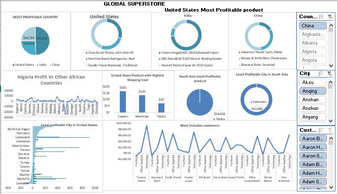
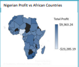

# Global-Superstore

## Introduction

Global Superstore is a global online retailer based in New York, boasting a broad product catalog and
aiming to be a one-stop-shop for its customers. Global The superstore’s clientele, hailing from 147
different countries, can browse through an endless offering with more than 10,000 products. This large
selection comprises three main categories: office supplies (e.g., staples), furniture (e.g., chairs), and
technology (e.g., smartphones).

**_ Disclaimer**_: _ All dataset does not represent any company but just a dummy datasets to demonstarate capabilities of Excel, Power BI._

# Problem Statement

 Question 1.
 
a) What are the three countries that generated the highest total profit for Global Superstore in 2014?

b) For each of these three countries, find the three products with the highest total profit. Specifically,
what are the products’ names and the total profit for each product?

Question 2.

a) Identify the 3 subcategories with the highest average shipping cost in the United States.

Question 3.

a) Assess Nigeria’s profitability (i.e., total profit) for 2014. How does it compare to other African
countries?

b) What factors might be responsible for Nigeria’s poor performance? You might want to investigate
shipping costs and the average discount as potential root causes.

Question 4.

a) Identify the product subcategory that is the least profitable in Southeast Asia.
Note: For this question, assume that Southeast Asia comprises Cambodia, Indonesia, Malaysia, Myanmar
(Burma), the Philippines, Singapore, Thailand, and Vietnam.

b) Is there a specific country i n Southeast Asia where Global Superstore should stop offering the
subcategory identified in 4a?

Question 5.

a) Which city is the least profitable (in terms of average profit) in the United States? For this analysis,
discard the cities with less than 10 Orders. b) Why is this city’s average profit so low?

Question 6.

a) Which product subcategory has the highest average profit in Australia?
Question 7.

a)Who are the most valuable customers and what do they purchase?

# Skill

- Ms Excel
- Pivot Table
- Charts
- Map
- Power Query
- Data Modeling
- Data Cleaning
- Data Visualization etc.,

# Modeling

## II

# Analysis

- Nigeria made the least profit in 2014 due to high cost of shipping discount.
- United States, India and China had the highest total.
- Lancaster made the least profit with 46 orders in United States.
- Australia made more profit on tables compared to other products.
- The most valuable players are listed on the dashboard alongside with the product purchased.

Click [here](https://docs.google.com/spreadsheets/d/1nxESpFzWjlGDMGDVLH69xmDzIl9l6OEq/edit#gid=633280281) to interact with the datasets.

 # Conclusion

 The datasets of the previous year will be required for comparison and data driven decision.

 

